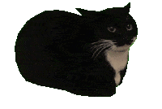

# Heyy~, welcome to coolGi's profile!
A small ~~Aussie~~Kiwi programming garl who likes to nibble at random projects. ^^

# Personal projects avalable at [GitLab](https://gitlab.com/coolGi)
I do not like the direction Microsoft is going, with any of their products (including Github), especially with the constant promoting of licence-infringing AI tools, and bloated Github features, unrelated to development, making it feel more like a social media platform (such as badges, feeds, events, etc).
Hence, my Github account is purley for contributins to other projects and I will not be mirroring repos or doing any personal work here.

If you want to contact me directly, send me a message on my [Matrix](https://joinmatrix.org/) at [@me:coolgi.dev](https://matrix.to/#/@me:coolgi.dev)
Otherwise please use my GitLab viewing my future projects.

Have a spinning cat for your troubles~\

